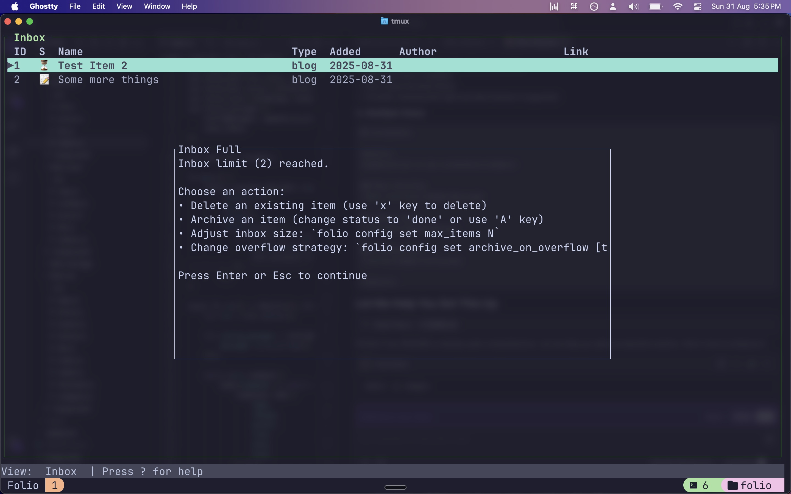

# Folio

*A personal bookmark and link management tool with a "read it or lose it" philosophy*

## Why?

I bookmark/save plenty of articles/blog posts etc and that floods my to read list. Which means when I get to it, it is overwhelming and there is no real way for me to discern what I must read and what is potnetially fluff.

So now, I made a small tool where I can only have a limited number of items in my to read list. Anything more that I want to add? Either read something that or delete something. Simple as. Or of course watch/listen for videos/podcast respectively.

## Screenshot



Hopefully this will also make me deliberate in what I add in the first place.

## Install

Clone it and build it. And it is yours. Do as you see fit.

```bash
git clone https://github.com/smitchaudhary/folio.git
cd folio

cargo install --path crates/folio-bin
```

## How To

It is simple tool and the help section should be self explanatory but a list of basic commands

### Add Your First Item using CLI
```bash
folio add --name "Some title" --type blog_post --link "https://example.com/blog_1"

# Add a video
folio add --name "My fav video" --type video --author "Some dude"

# Add a podcast
... (you get it now)
```

### View Your Items
```bash
folio list

# List only videos
folio list --type video

folio list | grep -i rust
```

### Interactive Mode

You can also use the TUI

```bash
folio

folio add
```

## Item Types

The items can be of one of these 7 types (including others for a catch-all)

| Type | Description | CLI Usage | Display |
|------|-------------|-----------|---------|
| **Blog Post** | Articles, essays, blog posts | `blog_post` | `blog` |
| **Video** | Videos, talks, lectures | `video` | `vid.` |
| **Podcast** | Audio content, episodes | `podcast` | `pod.` |
| **News** | News articles, breaking news | `news` | `news` |
| **Thread** | Twitter threads, forum discussions | `thread` | `thrd` |
| **Academic Paper** | Research papers, academic content | `academic_paper` | `acad` |
| **Other** | Miscellaneous content | `other` | `oth.` |

## Usage

### Basic Commands

```bash
folio add --name "Title" --type video --link "https://..." --author "Creator"

folio list                    # All items
folio list --type video       # Filter by type
folio list --status todo      # Filter by status

# Update status
folio set-status 1 done       # Mark item #1 as done
folio set-status 2 doing      # Mark item #2 as in progress

# Edit items
folio edit 1                  # Edit item #1 interactively

# Remove items
folio delete 1                # Delete item #1
folio archive 1               # Move to archive

# Manage references
folio mark-ref 1              # Mark/unmark as reference

# Config
folio config list             # Show current config
folio config set max_items 50 # Set inbox limit
folio config set archive_on_overflow todo  # Auto-archive oldest todo items
```

### Status

Each item has one of three statuses:
- **📝 Todo**: Not started yet
- **⏳ Doing**: Currently working on
- **✅ Done**: Completed (automatically archived)

### Interactive Terminal UI

Launch the TUI for a more visual experience:
```bash
folio
```

**TUI Controls:**
- `↑/↓` or `j/k`: Navigate items
- `Enter`: Open link
- `a`: Add new item
- `e`: Edit selected item
- `t/i/d`: Change status (todo/in progress/done)
- `x`: Delete item
- `r`: Toggle reference status
- `Tab`: Switch between Inbox/Archive
- `/`: Filter items
- `C`: Configuration
- `?`: Help
- `q/Esc`: Quit

## Config

Folio stores config in `~/.folio/config.json`:

```json
{
  "max_items": 30,
  "archive_on_overflow": "abort",
  "_v": 1
}
```

The version thing is in case I want to later change something and then migrate stuff.

### Overflow Strategies

- **`abort`**: Prevent adding new items (safest)
- **`todo`**: Auto-archive oldest todo items (the lose it of the "read it or lose it thing")

## Data Storage

Folio stores your data locally in `~/.folio/`:

```
~/.folio/
├── inbox.jsonl      # Active items
├── archive.jsonl    # Completed items
└── config.json      # User preferences
```

**Data Format:**
```json
{"name":"Rust Guide","type":"blog_post","status":"todo","author":"Rust Team","link":"https://...","added_at":"2024-01-01T00:00:00Z","version":1}
```

## Philosophy & Design

### Read It or Lose It
Folio enforces the "read it or lose it" philosophy by:
- Limiting inbox size to prevent accumulation
- Requiring active management of your backlog
- Providing clear status tracking
- Making it easy to archive or delete items

### Why This Approach Works
1. **Prevents Procrastination**: Limited space forces prioritization
2. **Reduces Decision Fatigue**: Clear actions (read/delete/archive)
3. **Maintains Quality**: Only keep what matters
4. **Provides Satisfaction**: Real progress, not just accumulation

## License

No license. It is just some basic code. Do what you want with it.
